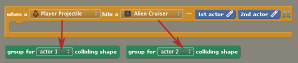

# palette.collisions.basic

## Actor 1 vs. Actor 2

Each block in this section lets you choose between Actor 1 and Actor 2. Collision events involve 2 actors. When the event is reported, the first actor in the event's block corresponds to Actor 1 and the second actor in the block corresponds to Actor 2.



You can refer to Actor 1 and Actor 2 directly using the blocks embedded in the event itself.


# collision-top,collision-left,collision-bottom,collision-right -- Top / Left / Bottom / Right Side was Hit

Returns `true` if the actor's [top/left/bottom/right] side was hit. If the collision shape is not a box, we still approximate the shape as a box to calculate this.

{ images }

$blockImage([collision-top d:"hit_yes" d:this])
$blockImage([collision-left d:"hit_yes" d:this])<br/>
$blockImage([collision-bottom d:"hit_yes" d:this])
$blockImage([collision-right d:"hit_yes" d:this])

{ code }

```
$blockCode([collision-top d:"hit_yes" d:this])
$blockCode([collision-left d:"hit_yes" d:this])
$blockCode([collision-bottom d:"hit_yes" d:this])
$blockCode([collision-right d:"hit_yes" d:this])

$blockCode([collision-top d:"hit_yes" d:other])
$blockCode([collision-left d:"hit_yes" d:other])
$blockCode([collision-bottom d:"hit_yes" d:other])
$blockCode([collision-right d:"hit_yes" d:other])
```

# collision-shape-group2 -- Group of Colliding Shape

Returns the group of the shape for the "other" (or "second") object in the collision. In most cases, the group of the shape is the same as that of the actor, but that [isn't always the case]($pedia/collisions-and-groups/).

# collision-type2 -- Hit an Actor / Terrain / Tile / Sensor

Returns `true` if the "other" (or "second") object in the collision was an [actor / terrain region / tile / sensor].

{ code }

```
$blockCode([collision-type2 d:active d:this d:actor])
$blockCode([collision-type2 d:active d:this d:terrain])
$blockCode([collision-type2 d:active d:this d:tile])
$blockCode([collision-type2 d:active d:this d:sensor])
```