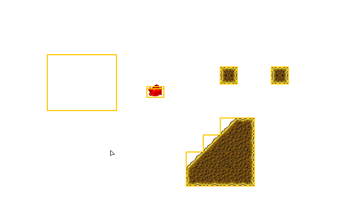

# print -- Print

Adds the text you specify to your logs, which can be viewed in the **Log Viewer**. Use this block to verify values and debug your game when you encounter bugs. Accepts anything but will convert to text before printing.

{ code }

```
trace([ANYTHING]);
```

# comment-short,comment-long -- Comment (Single Line, Multiple Lines)

Comments let you mark up your behaviors. They are like sticky notes. They have no effect on a behavior.

{ images }

$blockImage([comment-short text])<br/>
$blockImage([comment-long ""])

{ code }

```
/* [ANYTHING] */
```

# comment-wrapper -- Comment (Wrapper)

This variant of comments wraps around a stack of blocks. It has no effect on the enclosed blocks (in other words, the code inside still runs).

{ code }

```
/* [ANYTHING] */
  [ACTIONS]
  //---
```

# palette.flow.debug.draw -- Debug Drawing

# debug-draw -- Enable / Disable Debug Drawing

Outlines collision boxes, tiles, regions and terrain regions for debug purposes. Useful for testing physics/collisions. Can also be activated from the menu (prior to testing) via **Run > Enable Debug Drawing**.

